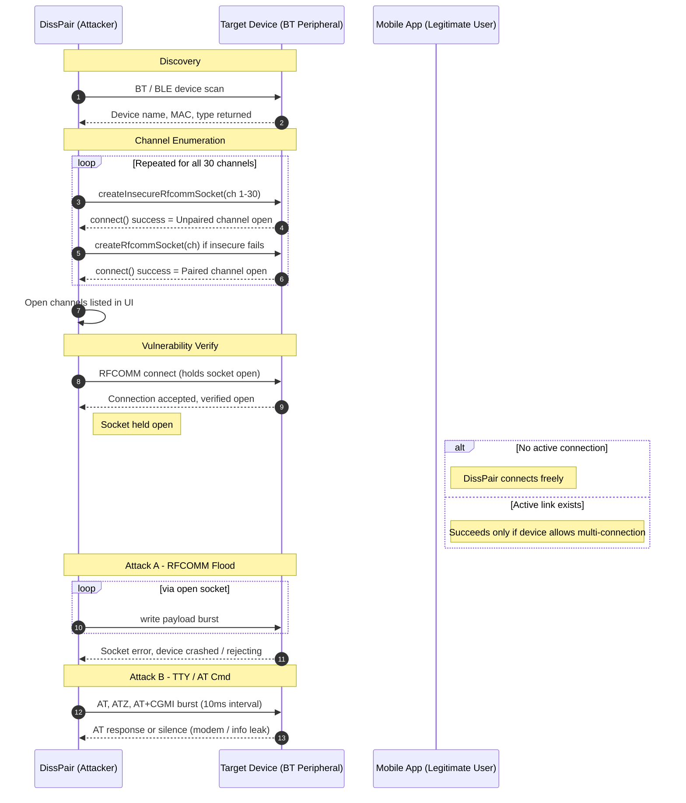

<div align="center">

# DissPair APK

### Bluetooth Security Toolkit

**A Python-based Android application for Security testing Bluetooth Classic and BLE in authorized lab environments.**

[](.)
[](https://cve.mitre.org/cgi-bin/cvename.cgi?name=CVE-2025-13834)
[](.)
[](.)

</div>

---

> ⚠️ **Authorized Use Only**
> This tool is intended strictly for use on devices you personally own or
> have explicit written permission to test. Unauthorized use against
> third-party devices may violate local and international law.
> The app includes a confirmation step before any analysis begins —
> you must acknowledge device ownership each session.
>
> ⚠️ **Potentially Harmful Capabilities & Risk Disclosure**
>
> This tool is strictly intended for educational purposes, security research, and authorized security auditing. It contains features that can cause operational disruption to target hardware if used improperly:
>
> 1. RFCOMM Hardware Flooding: The "Flood" module intentionally injects dense byte streams into targeted Bluetooth channels. On vulnerable, legacy, or unpatched Bluetooth stacks, this can cause buffer overflows, resulting in the target device freezing, kernel panics, or complete Denial of Service (DoS).
>
> 2. Payload Injection & State Manipulation: The ability to inject raw AT commands (e.g., HFP manipulation) and OBEX payloads can alter the operational state of target devices, potentially causing unauthorized call manipulation or disrupting audio gateways.
>
> 3. GATT Interaction: Unauthenticated reading/writing of BLE characteristics may expose sensitive plaintext data or alter IoT device configurations.
>
> The developer assumes no liability for misuse or damage caused by this software. Use exclusively on hardware you own or have explicit consent to audit.

---

## Overview

DissPair APK is a pure-Python Android application built with the **Kivy**
framework. It is designed for hardware students and protocol researchers who
want to understand how Bluetooth Classic RFCOMM channels behave at a low
level on their own devices.

It uses Android's native Bluetooth API via **Java Native Interface (JNI)**
to interact directly with the device's Bluetooth stack, allowing you to
observe real protocol behavior without relying solely on higher-level
abstractions like SDP.

---

## Repository Structure

```
disspair/
├── main.py               # Kivy application + Bluetooth analysis logic
├── buildozer.spec        # Android NDK/SDK build configuration + permissions
├── disspair_logo.png     # App icon and splash screen asset
├── requirements.txt      # Python build dependencies (Buildozer, Cython 0.29.36)
└── README.md
```

> All four files must be present in the same directory before building.

---

## Installation

### Direct Install (Pre-Built APK)

1. Download `disspair.apk` from the [Releases](../../releases) tab
2. On your Android device, allow your browser or file manager to
   **Install unknown apps**
3. Open the app and grant the requested **Location** and
   **Nearby Devices** permissions
   > These permissions are required for Bluetooth scanning on Android 12+

### Build from Source

#### 1. Install System Dependencies

> Ubuntu, Debian, or Kali Linux are recommended.

```bash
sudo apt update
sudo apt install -y git zip unzip openjdk-17-jdk python3-pip autoconf libtool \
  pkg-config zlib1g-dev libncurses5-dev libncursesw5-dev libtinfo5 cmake \
  libffi-dev libssl-dev
```

#### 2. Set Up Python Virtual Environment

> ⚠️ Use an isolated virtual environment to avoid PEP 668 conflicts.
> You **must** use Cython `0.29.36` — newer versions (3.x) cause `pyjnius`
> to fail with legacy `long` variable errors.

```bash
python3 -m venv disspair_env
source disspair_env/bin/activate
pip install -r requirements.txt
```

#### 3. Export Java Path

```bash
export JAVA_HOME=$(ls -d /usr/lib/jvm/java-17-openjdk* | head -n 1)
export PATH=$JAVA_HOME/bin:$PATH
```

#### 4. Build

```bash
buildozer android debug
```

> First run downloads the Android SDK and NDK (several GB).
> Allow **15–30 minutes** depending on your connection and CPU.
> The compiled APK will appear in `bin/`.

---

## How It Works



### Step 1 — Device Discovery

| Button | Description |
|--------|-------------|
| **SCAN CLASSIC** | Discovers nearby BR/EDR devices in range using Android's `startDiscovery` API |
| **SCAN BLE** | Passively listens for BLE advertisement packets (Under Development) |

Paired devices are loaded automatically from your local Bluetooth cache on startup.

### Step 2 — Channel Analysis

Tap **ANALYSE** on any Classic or Paired device to open the Channel Analyser.

The tool probes channels 1–30 using direct RFCOMM connection attempts,
showing which channels are actively accepting connections and whether they
require pairing. These supplements what SDP advertises and help you
understand your device's true channel configuration.

### Step 3 — Protocol Interaction

Once active channels are discovered, three interaction options are available:

| Action | Description |
|--------|-------------|
| **CONNECT** | Opens and holds an RFCOMM connection to verify a channel is live |
| **AT Probe** | Sends a standard Hayes AT command sequence to study how your device's serial profile responds |
| **Flood TEST** | Transmits a sustained data stream to observe how your device handles connection load and buffer behaviour under pressure |

The **Payload Slider** (64 B → 64 KB) controls the data block size used
during the flood test.

---

## Who Is This For?

- Students learning Bluetooth protocol internals on their own hardware
- Hardware developers validating their own Bluetooth implementations
- Security researchers studying RFCOMM behaviour in controlled lab setups
- Hobbyists exploring the Android Bluetooth stack on personal devices

---

## Security and Abuse Reporting

If you need to report a security vulnerability, malicious activity, or third-party abuse related to this tool, please see our [Security Policy](https://github.com/threadpoolx/DissPair/blob/main/Security.md) for contact details and responsible disclosure guidelines.

---

## Legal & Ethical Use

Only use DissPair against:
- Devices you personally own
- Devices where you have **explicit written authorization** from the owner

Never use this tool in public spaces, against vehicles, infrastructure,
or any device belonging to someone else.

The app enforces an authorization confirmation before every analysis
session. This is not just a disclaimer — it is a functional gate built
into the application.

---

<div align="center">
<sub>Bluetooth Security Toolkit · Android Edition</sub>
</div>


This is current Readme, what changes to make?
