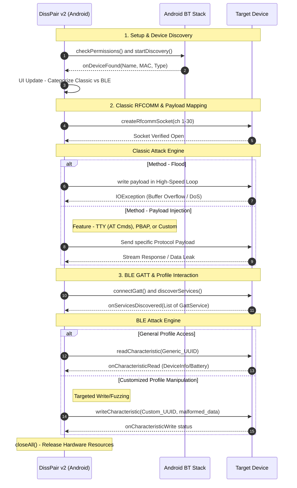

<div align="center">

# DissPair APK

### Bluetooth Security Toolkit

**A native Android application built with Kotlin & Jetpack Compose for security testing Bluetooth Classic and BLE in authorized lab environments.**

[](.)
[](.)
[](.)
[](.)

</div>

---

> ⚠️ **Authorized Use Only**
> This tool is intended strictly for use on devices you personally own or
> have explicit written permission to test. Unauthorized use against
> third-party devices may violate local and international law.
> The app includes a confirmation step before any analysis begins —
> you must acknowledge device ownership each session.
>
> ⚠️ **Potentially Harmful Capabilities & Risk Disclosure**
>
> This tool is strictly intended for educational purposes, security research, and authorized security auditing. It contains features that can cause operational disruption to target hardware if used improperly:
>
> 1. **RFCOMM Hardware Flooding:** The "Flood" module intentionally injects dense byte streams into targeted Bluetooth channels. On vulnerable, legacy, or unpatched Bluetooth stacks, this can cause buffer overflows, resulting in the target device freezing, kernel panics, or complete Denial of Service (DoS).
>
> 2. **Payload Injection & State Manipulation:** The ability to inject raw AT commands (e.g., HFP handshake manipulation) and OBEX payloads can alter the operational state of target devices, potentially causing unauthorized call manipulation or disrupting audio gateways.
>
> 3. **GATT Interaction:** Unauthenticated reading/writing of BLE characteristics may expose sensitive plaintext data or alter IoT device configurations.
>
> The developer assumes no liability for misuse or damage caused by this software. Use exclusively on hardware you own or have explicit consent to audit.

---

## Overview

DissPair APK is a **native Android application** written in **Kotlin** with a **Jetpack Compose** UI. It is designed for hardware students and protocol researchers who want to understand how Bluetooth Classic RFCOMM channels and BLE GATT services behave at a low level on their own devices.

It uses Android's native Bluetooth APIs directly — including `BluetoothAdapter`, `BluetoothGatt`, and reflection-based `createRfcommSocket` / `createInsecureRfcommSocket` calls — to interact with the device's Bluetooth stack without relying on higher-level abstractions like SDP alone.

---

## Repository Structure

```
DisspairAPK/
├── app/
│   └── src/
│       └── main/
│           ├── java/org/disspair/disspair/
│           │   └── MainActivity.kt        # Core app logic, UI, Bluetooth analysis
│           └── res/
│               └── drawable/
│                   └── disspair_logo.png  # App icon
├── build.gradle
└── README.md
```

---

## Requirements

- Android **6.0 (API 23)** or higher
- Android **12+ (API 31)** requires `BLUETOOTH_SCAN` and `BLUETOOTH_CONNECT` permissions
- Location services must be enabled for Bluetooth scanning
- For Classic device analysis: Location + Nearby Devices permissions

---

## Installation

### Direct Install (Pre-Built APK)

1. Download `disspair.apk` from the [Releases](../../releases) tab
2. On your Android device, allow your browser or file manager to **Install unknown apps**
3. Open the app and grant the requested **Location** and **Nearby Devices** permissions

> These permissions are required for Bluetooth scanning on Android 12+

### Build from Source

#### 1. Clone the Repository

```bash
git clone https://github.com/threadpoolx/DissPair.git
cd DissPair
git checkout APK
```

#### 2. Open in Android Studio

- Open **Android Studio** (Hedgehog or newer recommended)
- Select **Open** and navigate to the cloned directory
- Let Gradle sync complete

#### 3. Build & Run

```bash
# Via Android Studio: Build > Build Bundle(s) / APK(s) > Build APK(s)

# Or via command line:
./gradlew assembleDebug
```

The compiled APK will appear in `app/build/outputs/apk/debug/`.

> Ensure you have **Android SDK**, **Android NDK**, and **JDK 17** installed and configured in Android Studio.

---

## How It Works


---

## Features

### Device Discovery

| Button | Description |
|--------|-------------|
| **SCAN CLASSIC** | Discovers nearby BR/EDR devices using Android's `startDiscovery` API. Loops up to 5 scan cycles to maximize coverage. |
| **SCAN BLE** | Passively listens for BLE advertisement packets via `BluetoothLeScanner`. |

Paired devices are loaded automatically from the local Bluetooth bond cache on startup and shown via the **Paired** toggle.

---

### Classic Auditor

Tap **ANALYSE** on any Classic or Paired device to open the RFCOMM Channel Auditor.

#### Channel Enumeration
Probes channels **1–15** by default (expandable to **16–30** via the `PROBE 16-30` button) using direct RFCOMM connection attempts. Reports which channels are live and whether they accept unpaired (insecure) or paired (secure) connections.

#### Per-Channel Actions

| Action | Description |
|--------|-------------|
| **PAYLOADS** | Opens the payload dialog to send a predefined or custom payload to the channel |
| **FLOOD** | Transmits a continuous 2048-byte burst stream to stress-test the target's RFCOMM buffer handling |

#### Payload Dialog
- **AT Command: Connect** — Sends `ATZ\r\n` (Hayes modem reset/ping)
- **PBAP/MAP: OBEX Connect** — Sends a raw OBEX `0x80` Connect PDU
- **Custom Payload** — Enter any AT command; `\r\n` is auto-appended
- Includes automatic **HFP handshake detection and bypass** — if the target opens with an `AT+BRSF` prompt, the tool auto-negotiates with `AT+BRSF=0` before injecting the chosen payload

---

### GATT Auditor (BLE)

Tap **ANALYSE** on any BLE device to open the GATT Auditor.

- Establishes a GATT connection and enumerates all services and characteristics
- Displays service type (**General** for standard 16-bit Bluetooth UUIDs, **Customized** for vendor UUIDs)
- Per-characteristic actions:

| Action | Description |
|--------|-------------|
| **READ** | Reads the current value of the characteristic |
| **WRITE** | Opens a write dialog supporting ASCII or raw Hex input |

- Toggle **HEX / ASCII** display for all captured values

---

### System Log

A live scrolling terminal log at the top of the main screen and within each overlay shows all events, discovered targets, errors, and decoded responses in color-coded monospace output.

---

## Who Is This For?

- Students learning Bluetooth protocol internals on their own hardware
- Hardware developers validating their own Bluetooth implementations
- Security researchers studying RFCOMM and GATT behaviour in controlled lab setups
- Hobbyists exploring the Android Bluetooth stack on personal devices

---

## Security and Abuse Reporting

If you need to report a security vulnerability, malicious activity, or third-party abuse related to this tool, please see our [Security Policy](https://github.com/threadpoolx/DissPair/blob/main/Security.md) for contact details and responsible disclosure guidelines.

---

## Legal & Ethical Use

Only use DissPair against:
- Devices you personally own
- Devices where you have **explicit written authorization** from the owner

Never use this tool in public spaces, against vehicles, infrastructure, or any device belonging to someone else.

The app enforces an authorization confirmation before every analysis session. This is not just a disclaimer — it is a functional gate built into the application.

---

<div align="center">
<sub>Bluetooth Security Toolkit · Native Android Edition · Kotlin + Jetpack Compose</sub>
</div>
