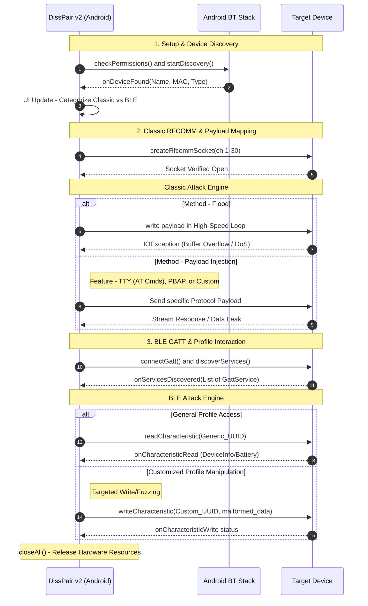

<div align="center">

# DissPair

### Bluetooth Security Toolkit

**A multi-platform educational toolkit for understanding Bluetooth Classic (RFCOMM) and BLE (GATT) protocol behavior in controlled, authorized lab environments.**

[](.)
[](.)
[](.)
[](.)

</div>

---

> ⚠️ **Authorized Use Only**
> This toolkit is intended strictly for use on devices you personally own or have explicit written permission to test. Unauthorized use against third-party devices may violate local and international law. The authors assume no liability for misuse.
>
> ⚠️ **Potentially Harmful Capabilities & Risk Disclosure**
>
> This tool contains features that can cause operational disruption to target hardware if used improperly:
>
> 1. **RFCOMM Hardware Flooding:** The "Flood" module intentionally injects dense byte streams into targeted Bluetooth channels. On vulnerable, legacy, or unpatched Bluetooth stacks, this can cause buffer overflows, resulting in the target device freezing, kernel panics, or complete Denial of Service (DoS).
>
> 2. **Payload Injection & State Manipulation:** The ability to inject raw AT commands (e.g., HFP handshake manipulation) and OBEX payloads can alter the operational state of target devices, potentially causing unauthorized call manipulation or disrupting audio gateways.
>
> 3. **GATT Interaction:** Unauthenticated reading/writing of BLE characteristics may expose sensitive plaintext data or alter IoT device configurations.
>
> Use exclusively on hardware you own or have explicit consent to audit.

---

## What is DissPair?

DissPair is a Bluetooth security learning toolkit designed for students, hardware developers, and security researchers to explore low-level behavior of:

- **Bluetooth Classic (RFCOMM)**
- **Bluetooth Low Energy (BLE GATT)**

Unlike many tools that rely purely on Service Discovery Protocol (SDP), DissPair actively probes and interacts with devices to reveal **real behavior vs advertised behavior**.

It is designed for use in **personal lab environments** — testing your own devices, understanding protocol fundamentals, and learning how Bluetooth service discovery and channel communication works under the hood.

---

## Platform Variants

<div align="center">

| | Platform | Description |
|--|----------|-------------|
| 📱 | **Android** | Native Kotlin app with Jetpack Compose UI for on-device Bluetooth analysis. Field learning — explore Bluetooth environments from a mobile device. |
| 🐧 | **Linux** | Python-based tool using BlueZ and raw Bluetooth sockets. Desktop study — terminal-based protocol analysis with minimal dependencies. |

</div>

---

## Core Workflow

```text
Scan   →  Discover nearby Bluetooth devices (Classic BR/EDR and BLE)
  ↓
Sweep  →  Probe RFCOMM channels (1–30) on your own device
  ↓
Map    →  Identify active vs advertised services
  ↓
Analyze → Interact with protocols (RFCOMM / GATT) to study behavior
```

---

## Who Is This For?

- Students learning Bluetooth protocol internals on their own hardware
- Hardware hobbyists auditing and validating their own devices
- Security researchers studying RFCOMM/GATT behavior in lab setups
- Developers building Bluetooth-enabled hardware who want to validate their own implementations

---

---

# 📱 Android Application (DissPair APK)

## Overview

DissPair APK is a **native Android application** written in **Kotlin** with a **Jetpack Compose** UI. It uses Android's native Bluetooth APIs directly — including `BluetoothAdapter`, `BluetoothGatt`, and reflection-based `createRfcommSocket` / `createInsecureRfcommSocket` calls — to interact with the device's Bluetooth stack without relying on higher-level abstractions.

The app enforces an authorization confirmation before every analysis session. This is not just a disclaimer — it is a functional gate built into the application.

---

## Repository Structure

```
DisspairAPK/
├── app/
│   └── src/
│       └── main/
│           ├── java/org/disspair/disspair/
│           │   └── MainActivity.kt        # Core app logic, UI, Bluetooth analysis
│           └── res/
│               └── drawable/
│                   └── disspair_logo.png  # App icon
├── build.gradle
└── README.md
```

---

## Requirements

- Android **6.0 (API 23)** or higher
- Android **12+ (API 31)** requires `BLUETOOTH_SCAN` and `BLUETOOTH_CONNECT` permissions
- Location services must be enabled for Bluetooth scanning
- For Classic device analysis: Location + Nearby Devices permissions

---

## Installation

### Direct Install (Pre-Built APK)

1. Download `disspair.apk` from the [Releases](../../releases) tab
2. On your Android device, allow your browser or file manager to **Install unknown apps**
3. Open the app and grant the requested **Location** and **Nearby Devices** permissions

> These permissions are required for Bluetooth scanning on Android 12+

### Build from Source

#### 1. Clone the Repository

```bash
git clone https://github.com/threadpoolx/DissPair.git
cd DissPair
git checkout APK
```

#### 2. Open in Android Studio

- Open **Android Studio** (Hedgehog or newer recommended)
- Select **Open** and navigate to the cloned directory
- Let Gradle sync complete

#### 3. Build & Run

```bash
# Via Android Studio: Build > Build Bundle(s) / APK(s) > Build APK(s)

# Or via command line:
./gradlew assembleDebug
```

The compiled APK will appear in `app/build/outputs/apk/debug/`.

> Ensure you have **Android SDK**, **Android NDK**, and **JDK 17** installed and configured in Android Studio.

---

## How It Works


```mermaid
sequenceDiagram
    autonumber
    participant D as DissPair v2 (Android)
    participant B as Android BT Stack
    participant T as Target Device

    Note over D, T: 1. Setup & Device Discovery
    D->>B: checkPermissions() and startDiscovery()
    B-->>D: onDeviceFound(Name, MAC, Type)
    D->>D: UI Update - Categorize Classic vs BLE

    Note over D, T: 2. Classic RFCOMM & Payload Mapping
    D->>T: createRfcommSocket(ch 1-30)
    T-->>D: Socket Verified Open

    Note over D, T: Classic Attack Engine
    alt Method - Flood
        D->>T: write payload in High-Speed Loop
        T-->>D: IOException (Buffer Overflow / DoS)
    else Method - Payload Injection
        Note right of D: Feature - TTY (AT Cmds), PBAP, or Custom
        D->>T: Send specific Protocol Payload
        T-->>D: Stream Response / Data Leak
    end

    Note over D, T: 3. BLE GATT & Profile Interaction
    D->>T: connectGatt() and discoverServices()
    T-->>D: onServicesDiscovered(List of GattService)

    Note over D, T: BLE Attack Engine
    alt General Profile Access
        D->>T: readCharacteristic(Generic_UUID)
        T-->>D: onCharacteristicRead (DeviceInfo/Battery)
    else Customized Profile Manipulation
        Note right of D: Targeted Write/Fuzzing
        D->>T: writeCharacteristic(Custom_UUID, malformed_data)
        T-->>D: onCharacteristicWrite status
    end

    Note over D: closeAll() - Release Hardware Resources
```

---

## Features

### Device Discovery

| Button | Description |
|--------|-------------|
| **SCAN CLASSIC** | Discovers nearby BR/EDR devices using Android's `startDiscovery` API. Loops up to 5 scan cycles to maximize coverage. |
| **SCAN BLE** | Passively listens for BLE advertisement packets via `BluetoothLeScanner`. |

Paired devices are loaded automatically from the local Bluetooth bond cache on startup and shown via the **Paired** toggle.

---

### Classic Auditor (RFCOMM)

Tap **ANALYSE** on any Classic or Paired device to open the RFCOMM Channel Auditor.

#### Channel Enumeration

Probes channels **1–15** by default (expandable to **16–30** via the `PROBE 16-30` button) using direct RFCOMM connection attempts. Reports which channels are live and whether they accept unpaired (insecure) or paired (secure) connections.

#### Per-Channel Actions

| Action | Description |
|--------|-------------|
| **PAYLOADS** | Opens the payload dialog to send a predefined or custom payload to the channel |
| **FLOOD** | Transmits a continuous 2048-byte burst stream to stress-test the target's RFCOMM buffer handling |

#### Payload Dialog

- **AT Command: Connect** — Sends `ATZ\r\n` (Hayes modem reset/ping)
- **PBAP/MAP: OBEX Connect** — Sends a raw OBEX `0x80` Connect PDU
- **Custom Payload** — Enter any AT command; `\r\n` is auto-appended
- Includes automatic **HFP handshake detection and bypass** — if the target opens with an `AT+BRSF` prompt, the tool auto-negotiates with `AT+BRSF=0` before injecting the chosen payload

---

### GATT Auditor (BLE)

Tap **ANALYSE** on any BLE device to open the GATT Auditor.

- Establishes a GATT connection and enumerates all services and characteristics
- Displays service type (**General** for standard 16-bit Bluetooth UUIDs, **Customized** for vendor UUIDs)
- Per-characteristic actions:

| Action | Description |
|--------|-------------|
| **READ** | Reads the current value of the characteristic |
| **WRITE** | Opens a write dialog supporting ASCII or raw Hex input |

- Toggle **HEX / ASCII** display for all captured values

---

### System Log

A live scrolling terminal log at the top of the main screen and within each overlay shows all events, discovered targets, errors, and decoded responses in color-coded monospace output.

---

---

# 🐧 Linux CLI (DissPair CLI)

## Overview

A **Python-based command-line tool** using:

- Native Linux Bluetooth sockets (`AF_BLUETOOTH`)
- BlueZ stack

Allows **low-level protocol interaction without abstractions**.

---

## Supported Platforms

- Kali Linux (recommended)
- Ubuntu / Debian

> VM users must use a USB Bluetooth adapter

---

## Installation

### System Dependencies

```bash
sudo apt update
sudo apt install -y bluez rfkill
```

### Python Setup

```bash
python3 -m venv disspair_env
source disspair_env/bin/activate
pip install bleak
```

---

## Usage

```bash
source disspair_env/bin/activate
sudo $(which python3) disspair_kali.py
```

---

## Features & Workflow

### Step 1 — Discovery

- Scan Classic devices
- Scan BLE devices
- Load paired devices
- Manual MAC input

### Step 2 — Enumeration

- RFCOMM channel probing (1–30)
- BLE GATT enumeration

### Step 3 — Interaction

#### RFCOMM

- Connect to channel
- Send AT commands
- Flood testing

#### BLE

- Read characteristics
- Write characteristics

---

## Troubleshooting

```bash
sudo rfkill unblock bluetooth
sudo systemctl restart bluetooth
sudo hciconfig hci0 up
hciconfig -a
```

---

---

## Security & Abuse Reporting

If you need to report a security vulnerability, malicious activity, or third-party abuse related to this tool, please see the [Security Policy](https://github.com/threadpoolx/DissPair/blob/main/Security.md) for contact details and responsible disclosure guidelines.

---

## Legal & Ethical Use

Only use DissPair against:

- Devices you personally own
- Devices where you have **explicit written authorization** from the owner

Never use this tool against:

- Public devices
- Vehicles or infrastructure
- Third-party hardware without consent

---

<div align="center">
<sub>Bluetooth Security Toolkit · Android + Linux · Research Use Only</sub>
</div>
